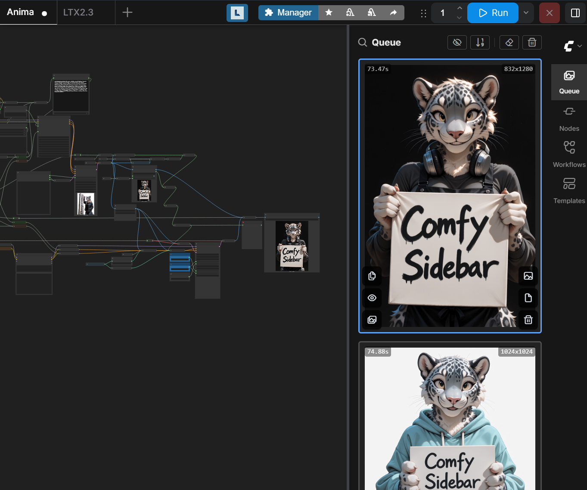
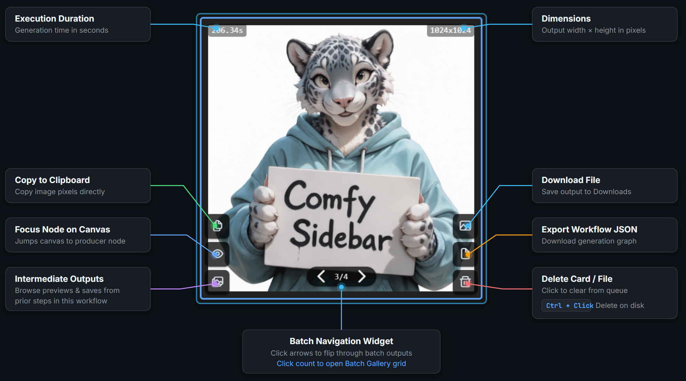
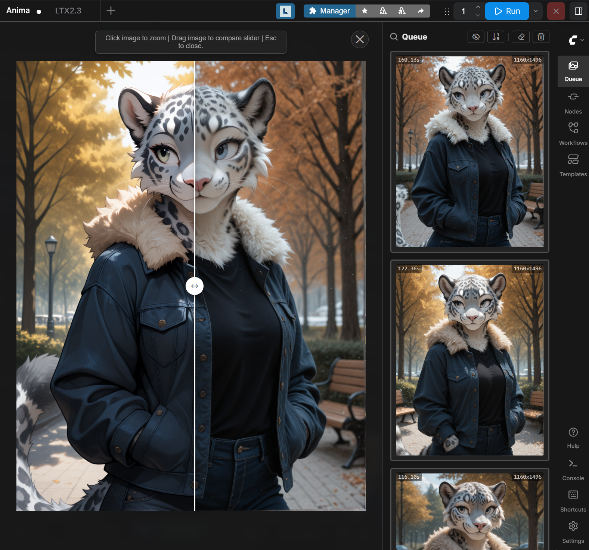
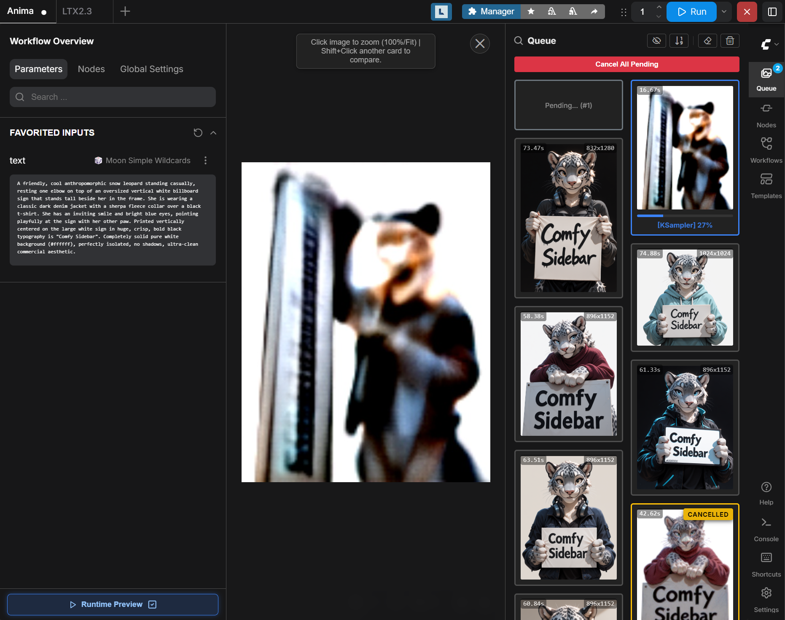

# ComfyUI-ComfySidebar

A compact and powerful layout overhaul for ComfyUI that makes generation results easier to browse, preview, compare, and manage.

## ✨ Features

* **Compact, information-dense layout** with visual previews that let you see what is happening at a glance. Optional UI elements and sidebar tabs can be hidden when you don't need them.

  
  
* **Left or right side:** Choose which side the sidebar appears on in ComfyUI settings.

* **Simplified mouse-friendly workflow** with drag-and-drop support and convenient actions for moving results back into the workflow, opening files, and managing outputs. Hold `Ctrl` for extra actions such as opening an image's location or deleting it directly from your device.

  

* **Built-in comparison tool** for quickly comparing two generated results side by side.

  

* **Runtime preview mode** combined with workflow overview makes ComfyUI practical for running and monitoring workflows in a more streamlined, queue-oriented way.

  

## 🛠️ Installation

### ComfyUI Registry

Install directly from the ComfyUI Manager or run:

```bash
comfy node install comfy-sidebar
```

ComfySidebar is available on the [ComfyUI Registry](https://registry.comfy.org/publishers/soundslikethunder/nodes/comfy-sidebar).

### Manual installation

Clone the repository into your ComfyUI custom nodes directory:

```bash
cd /path/to/ComfyUI/custom_nodes
git clone https://github.com/m0rtus59/ComfyUI-ComfySidebar.git
```

Restart ComfyUI and refresh the browser.

## ⚙️ Settings

Open **Settings → Comfy Sidebar** to configure:

* Queue layout and column width
* Queue display mode
* Working node display
* Automatic cleanup of cancelled or failed jobs
* Sidebar tabs to hide
* Stock Job History replacement
* Graph button visibility
* Unified top bar layout
* Permanent deletion behavior

## ⌨️ Controls

| Shortcut      | Action                                         |
| ------------- | ---------------------------------------------- |
| `Q`           | Toggle ComfySidebar                            |
| `Ctrl+Q`      | Exclude the selected node from sidebar results |
| `Alt+R`       | Renumber nodes in execution order              |
| `Click`       | Open result preview                            |
| `Shift+Click` | Compare another result                         |
| `Ctrl+Click`  | Open the file location / alternative action    |

You can also use the available actions from result cards, the sidebar header, and the node/canvas context menus.

## 📝 Notes

ComfySidebar integrates with the ComfyUI frontend and depends on parts of its UI structure. Frontend changes in ComfyUI may require updates to this extension.

## License

See [LICENSE](LICENSE).
